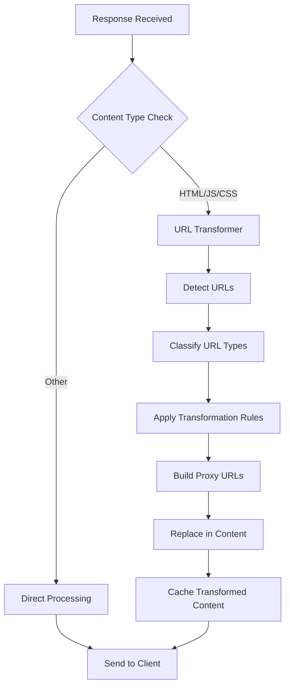
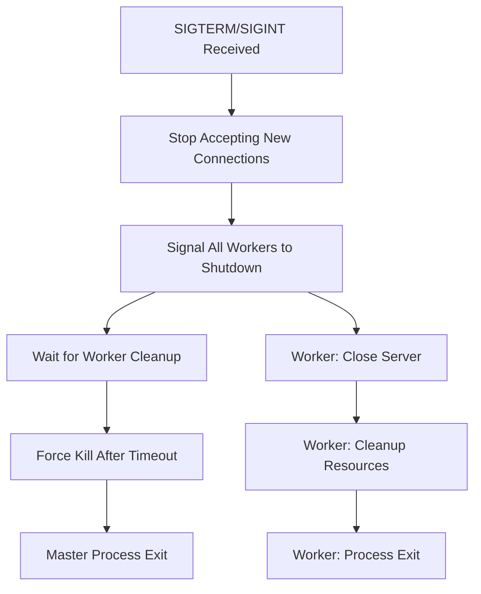

# Architecture Documentation for AI Assistants

This document provides a comprehensive architectural overview of the Advanced CDN application with domain-to-path prefix mapping functionality, specifically designed for AI assistants to understand the system structure, components, and relationships.

## System Overview

The Advanced CDN is a Node.js-based content delivery network that provides advanced domain-to-path prefix mapping capabilities. The system acts as a reverse proxy with intelligent routing, caching, and monitoring features.

### Core Architecture Pattern

```bash
[Client Request] → [CDN Entry Point] → [Domain Router] → [Path Rewriter] → [File Resolver] → [Backend Server]
                                    ↓                                        ↓
                                [Cache Layer] ← [File Resolution Cache] ← [Content Transformers]
                                    ↓
                                [Monitoring & Metrics]
```

## Component Architecture

### 1. Application Entry Points

#### `src/index.js`

- **Purpose**: Main application entry point
- **Responsibilities**: Bootstrap the application, handle clustering
- **Dependencies**: `src/cluster-manager.js`, `src/app.js`

#### `src/cluster-manager.js`

- **Purpose**: Multi-process management for performance
- **Responsibilities**: Worker process creation, load balancing, graceful shutdown
- **Configuration**: `ENABLE_CLUSTER`, `CLUSTER_WORKERS`

#### `src/app.js`

- **Purpose**: Express application setup and middleware configuration
- **Responsibilities**: Route setup, middleware chain, server initialization
- **Key Features**: Health checks, API endpoints, proxy setup

### 2. Core Routing System

#### `src/domain/path-rewriter.js` (NEW - Primary Innovation)

- **Purpose**: Domain-to-path prefix mapping engine
- **Architecture Pattern**: Strategy Pattern with Rule Engine
- **Key Components**:
  - `PathRewriter` class: Main orchestrator
  - Rule compilation engine: Converts configuration to optimized rules
  - Transformation cache: Performance optimization layer
  - Circuit breaker: Fault tolerance mechanism
  - Performance monitoring: Real-time metrics collection

**Class Structure**:

```javascript
class PathRewriter {
  constructor(config)           // Initialize with domain mappings
  transformPath(domain, path)   // Core transformation logic
  compileRule(domain, config)   // Rule optimization
  validateRules(rules)          // Configuration validation
  getStats()                    // Performance metrics
}
```

**Transformation Flow**:

1. Domain lookup in compiled rules
2. Cache check for previous transformations
3. Rule application (simple prefix or regex)
4. Fallback handling for unmatched domains
5. Performance tracking and circuit breaker evaluation

#### `src/domain/domain-manager.js`

- **Purpose**: Domain validation and management
- **Integration**: Works with `src/domain/path-rewriter.js` for domain routing
- **Responsibilities**: Domain whitelist validation, additional domain handling
- **Configuration**: `ORIGIN_DOMAIN`, `ADDITIONAL_DOMAINS`, `STRICT_DOMAIN_CHECK`

#### `src/domain/file-resolver.js` (NEW - File Resolution Engine)

- **Purpose**: Cascading file resolution with extensionless request handling
- **Architecture Pattern**: Chain of Responsibility Pattern with Circuit Breaker
- **Key Components**:
  - `FileResolver` class: Main orchestrator for file resolution
  - Extension cascade engine: Tries multiple file extensions in priority order
  - HTTP HEAD request engine: Checks file existence on backend servers
  - Circuit breaker: Protects against failing domains
  - Content transformation pipeline: Processes found files through transformers
  - Performance monitoring: Tracks resolution times and success rates

**Class Structure**:

```javascript
class FileResolver {
  constructor(config)                    // Initialize with extension priorities and transformers
  resolveFile(domain, path, extensions)  // Core file resolution logic
  checkFileExists(url)                   // HTTP HEAD request to check file existence
  transformContent(content, type)        // Apply content transformations
  getCacheKey(domain, path)              // Generate cache keys for resolution results
  getStats()                             // Performance and success rate metrics
}
```

**File Resolution Flow**:

1. Check if file resolution is enabled for domain
2. Generate list of URLs to try with different extensions
3. Use HTTP HEAD requests to check file existence
4. Cache both positive and negative results
5. Transform content if file found and transformation enabled
6. Track performance metrics and circuit breaker status

#### `src/transform/transformers/index.js` (NEW - Content Transformation System)

- **Purpose**: Plugin-based content transformation system
- **Architecture Pattern**: Strategy Pattern with Plugin Architecture
- **Built-in Transformers**:
  - Markdown to HTML transformer
  - JSON formatting transformer
  - CSV to HTML table transformer
  - XML formatting transformer
  - Plain text transformer

**Transformer Interface**:

```javascript
class Transformer {
  canTransform(contentType)              // Check if transformer supports content type
  transform(content, options)            // Transform content with options
  getOutputContentType()                 // Return transformed content type
}
```

#### `src/cache/file-resolution-cache.js` (NEW - Specialized File Resolution Cache)

- **Purpose**: High-performance caching for file resolution results
- **Architecture Pattern**: Cache-Aside Pattern with TTL Management
- **Key Features**:
  - Separate TTL for positive and negative results
  - LRU eviction policy
  - Domain-aware cache keys
  - Cache statistics and monitoring
  - Selective cache clearing

**Cache Key Strategy**:

```bash
Positive: file:domain.com:/path → {found: true, extension: 'md', transformed: true}
Negative: file:domain.com:/path → {found: false, extensionsTried: ['html', 'md', 'txt']}
```

#### `src/proxy/proxy-manager.js` (Enhanced)

- **Purpose**: HTTP proxy implementation with path transformation and file resolution
- **Architecture Pattern**: Decorator Pattern (enhances basic proxy with transformations)
- **Integration Points**:
  - Uses `src/domain/path-rewriter.js` for URL transformation
  - Uses `src/domain/file-resolver.js` for extensionless request handling
  - Integrates with `src/cache/cache-manager.js` for response caching
  - Connects to `src/monitoring/metrics-manager.js` for request tracking

**Enhanced Request Flow**:

```bash
Request → Domain Validation → Path Transformation → File Resolution → Backend Proxy → Content Transformation → Response Processing
```

### 3. Configuration Management

#### `src/config.js`

- **Purpose**: Centralized configuration management
- **Architecture Pattern**: Configuration Object Pattern
- **Key Sections**:
  - Server configuration (ports, SSL, clustering)
  - CDN configuration (domains, targets, path rewriting)
  - Cache configuration (TTL, size limits)
  - Security configuration (rate limiting, headers)
  - Monitoring configuration (health checks, metrics)

**Configuration Structure**:

```javascript
{
  server: { /* Basic server settings */ },
  cdn: {
    pathRewrite: {
      enabled: boolean,
      domains: { /* Domain-to-path mappings */ },
      rules: { /* Complex regex rules */ },
      fallback: { /* Fallback behavior */ }
    },
    fileResolution: {
      enabled: boolean,
      extensions: [ /* Extension priority list */ ],
      timeout: number,
      transformers: { /* Content transformation settings */ },
      cache: { /* File resolution cache settings */ },
      circuitBreaker: { /* Circuit breaker configuration */ },
      domainConfig: { /* Per-domain file resolution settings */ }
    }
  },
  cache: { /* Cache settings */ },
  security: { /* Security settings */ },
  monitoring: { /* Monitoring settings */ }
}
```

### 4. Caching Layer

#### `src/cache/cache-manager.js`

- **Purpose**: Intelligent caching with domain awareness
- **Architecture Pattern**: Cache-Aside Pattern with Domain Partitioning
- **Key Features**:
  - Domain-aware cache keys
  - Path prefix consideration
  - TTL management
  - Cache statistics by domain
  - Selective purging capabilities

**Cache Key Strategy**:

```bash
Standard: GET:/path
Domain-aware: GET:domain.com:/transformed/path
```

#### Nuclear Cache Clear Architecture

**Purpose**: System-wide cache clearing with comprehensive coordination across all cache types

**Architecture Pattern**: Coordinator Pattern with Error Isolation

**Key Components**:

- Multi-cache coordinator: Orchestrates clearing across all cache types
- Error isolation: Individual cache failures don't prevent other operations
- Comprehensive logging: Detailed operation tracking for each cache type
- Status aggregation: Multi-status response handling for partial failures

**Nuclear Cache Clear Flow**:

```bash
Nuclear Clear Request → Cache Type Discovery → Parallel Cache Operations → Status Aggregation → Response Generation
```

**Cache Types Coordinated**:

1. **Main Response Cache** (`cache-manager.js`)
   - Purges all cached HTTP responses
   - Returns count of items cleared
   - Tracks domain-specific cache keys

2. **URL Transformation Cache** (`url-transformer.js`)
   - Clears URL transformation results
   - Resets transformation statistics
   - Maintains cache performance metrics

3. **File Resolution Cache** (`file-resolution-cache.js`)
   - Clears file resolution results (if available)
   - Handles graceful degradation when module unavailable
   - Maintains positive/negative result separation

**Error Handling Architecture**:

```javascript
// Nuclear cache clear error isolation pattern
const clearedCaches = [];
const errors = [];

// Each cache operation is isolated
try {
  const result = cacheManager.purge('*');
  clearedCaches.push({
    cache: 'main',
    type: 'response-cache',
    itemsCleared: result.purged || 0,
    status: 'success'
  });
} catch (error) {
  errors.push({
    cache: 'main',
    error: error.message
  });
}

// Response includes both successes and failures
const response = {
  success: errors.length === 0,
  message: errors.length === 0 ? 'All caches cleared successfully' : 'Some caches failed to clear',
  data: {
    clearedCaches,
    totalCachesCleared: clearedCaches.length,
    errors: errors.length > 0 ? errors : undefined,
    timestamp: new Date().toISOString()
  }
};
```

#### File Resolution Cache Management Architecture

**Purpose**: Specialized cache management for file resolution operations with dual TTL support

**Architecture Pattern**: Cache-Aside Pattern with Specialized TTL Management

**Key Features**:

- **Dual TTL System**: Different TTL for positive vs negative results
- **LRU Eviction**: Automatic cleanup when cache reaches capacity
- **Statistics Tracking**: Comprehensive metrics for positive/negative hit rates
- **Memory Management**: Detailed memory usage tracking and optimization

**Cache Management Operations**:

```javascript
// File resolution cache architecture
class FileResolutionCacheManager {
  // Specialized cache clearing
  clear() {
    const size = this.cache.size;
    this.cache.clear();
    this.emit('clear', { previousSize: size });
  }
  
  // Comprehensive statistics
  getStats() {
    return {
      hits: this.stats.hits,
      misses: this.stats.misses,
      positiveHits: this.stats.positiveHits,
      negativeHits: this.stats.negativeHits,
      size: this.cache.size,
      maxSize: this.config.maxSize,
      hitRate: this.calculateHitRate(),
      positiveHitRate: this.calculatePositiveHitRate(),
      memoryUsage: this.getMemoryUsage()
    };
  }
}
```

### 5. Monitoring and Observability

#### `src/monitoring/metrics-manager.js`

- **Purpose**: Prometheus-compatible metrics collection
- **Architecture Pattern**: Observer Pattern
- **Key Metrics**:
  - Path transformation performance
  - Domain-specific request rates
  - Cache hit rates by domain
  - Circuit breaker status
  - Error rates and response times

#### `src/monitoring/health-manager.js`

- **Purpose**: Application health monitoring
- **Responsibilities**: System health checks, domain routing status
- **Integration**: Monitors `src/domain/path-rewriter.js` performance and circuit breaker status

#### `src/logger.js`

- **Purpose**: Centralized logging with structured output
- **Architecture Pattern**: Singleton Pattern
- **Features**: Module-specific loggers, log rotation, multiple output formats

### 6. Security and Rate Limiting

#### `src/middleware/rate-limiter.js`

- **Purpose**: Request rate limiting
- **Integration**: Can be configured per domain or globally
- **Configuration**: `RATE_LIMIT_ENABLED`, `RATE_LIMIT_MAX`, `RATE_LIMIT_WINDOW_MS`

## Data Flow Architecture

### 1. Request Processing Pipeline

```bash
1. Client Request
   ↓
2. Express Middleware Chain
   - Logging middleware
   - Security headers
   - Rate limiting
   ↓
3. Domain Validation (domain-manager.js)
   ↓
4. Path Transformation (path-rewriter.js)
   - Domain lookup
   - Rule application
   - Cache check
   ↓
5. File Resolution (file-resolver.js)
   - Check if extensionless request
   - Try multiple extensions via HTTP HEAD
   - Circuit breaker evaluation
   - File resolution cache check
   ↓
6. Content Transformation (transformers/index.js)
   - Apply content transformers if file found
   - Markdown to HTML, JSON formatting, etc.
   ↓
7. Proxy Request (proxy-manager.js)
   - Backend request (if file not resolved)
   - Response processing
   ↓
8. Cache Storage (cache-manager.js & file-resolution-cache.js)
   ↓
9. Metrics Collection (metrics-manager.js)
   ↓
10. Client Response
```

### 2. Configuration Flow

```bash
Environment Variables (.env)
   ↓
Configuration Parser (config.js)
   ↓
Component Initialization
   ↓
Runtime Configuration Updates (API endpoints)
```

### 3. Monitoring Data Flow

```bash
Component Events
   ↓
Metrics Collection (metrics-manager.js)
   ↓
Health Status Aggregation (health-manager.js)
   ↓
API Endpoints (/health, /metrics)
   ↓
External Monitoring Systems (Prometheus, Grafana)
```

## Key Design Patterns

### 1. Strategy Pattern (Path Rewriting)

- **Implementation**: `path-rewriter.js`
- **Purpose**: Different transformation strategies (simple prefix, regex, fallback)
- **Benefits**: Extensible, testable, configurable

### 2. Observer Pattern (Metrics)

- **Implementation**: `metrics-manager.js`
- **Purpose**: Event-driven metrics collection
- **Benefits**: Decoupled monitoring, real-time updates

### 3. Circuit Breaker Pattern (Fault Tolerance)

- **Implementation**: Within `path-rewriter.js`
- **Purpose**: Protect against cascading failures
- **Benefits**: System resilience, automatic recovery

### 4. Cache-Aside Pattern (Caching)

- **Implementation**: `cache-manager.js`
- **Purpose**: Application-managed caching
- **Benefits**: Fine-grained control, domain awareness

### 5. Decorator Pattern (Proxy Enhancement)

- **Implementation**: `proxy-manager.js`
- **Purpose**: Enhance basic proxy with transformations
- **Benefits**: Separation of concerns, composable functionality

### 6. Chain of Responsibility Pattern (File Resolution)

- **Implementation**: `file-resolver.js`
- **Purpose**: Try multiple file extensions in sequence until one succeeds
- **Benefits**: Flexible extension handling, easy to add new extensions

### 7. Plugin Pattern (Content Transformers)

- **Implementation**: `transformers/index.js`
- **Purpose**: Pluggable content transformation system
- **Benefits**: Extensible transformers, loose coupling, easy testing

### 8. Template Method Pattern (File Resolution Process)

- **Implementation**: `file-resolver.js`
- **Purpose**: Define file resolution algorithm with customizable steps
- **Benefits**: Consistent process, customizable behavior per domain

## Configuration Architecture

### Environment-Based Configuration

```bash
.env file → config.js → Component Configuration → Runtime Updates
```

### Domain Mapping Configuration

```javascript
// Simple prefix mapping
DOMAIN_PATH_MAPPING={"ddt.com": "/ddt", "blog.example.com": "/blog"}

// Complex regex rules
PATH_REWRITE_RULES={"api.example.com": {"^/v1/(.*)": "/api/v1/$1"}}

// Domain-specific backends
DOMAIN_TARGETS={"api.example.com": "api-backend.example.com"}
```

### File Resolution Configuration

```javascript
// Global file resolution settings
FILE_RESOLUTION_ENABLED=true
FILE_RESOLUTION_EXTENSIONS=html,md,json,csv,txt
FILE_RESOLUTION_TIMEOUT=5000
FILE_RESOLUTION_TRANSFORM_ENABLED=true

// Per-domain file resolution configuration
FILE_RESOLUTION_DOMAIN_CONFIG={
  "docs.example.com": {
    "enabled": true,
    "extensions": ["md", "html", "txt"],
    "transformEnabled": true,
    "transformMarkdown": true
  },
  "api.example.com": {
    "enabled": true,
    "extensions": ["json", "xml"],
    "transformEnabled": true,
    "transformJson": true
  }
}

// Content transformer configuration
FILE_RESOLUTION_TRANSFORMER_CONFIG={
  "markdown": {
    "enabled": true,
    "options": {
      "breaks": true,
      "linkify": true,
      "typographer": true
    }
  },
  "json": {
    "enabled": true,
    "options": {
      "pretty": true,
      "indent": 2
    }
  }
}
```

## Performance Architecture

### 1. Caching Strategy

- **Rule Compilation**: Pre-compiled regex patterns for performance
- **Transformation Cache**: LRU cache for transformation results
- **Response Cache**: Domain-aware HTTP response caching

### 2. Optimization Techniques

- **Connection Pooling**: Reuse HTTP connections to backends
- **Clustering**: Multi-process architecture for CPU utilization
- **Compression**: Gzip compression for bandwidth optimization

### 3. Performance Monitoring

- **Real-time Metrics**: Sub-millisecond transformation tracking
- **Benchmarking**: Automated performance testing framework
- **Alerting**: Threshold-based performance alerts

## Security Architecture

### 1. Domain Validation

- **Strict Domain Checking**: Whitelist-based domain validation
- **Additional Domains**: Configurable domain expansion
- **Host Header Validation**: Prevent host header injection

### 2. Rate Limiting

- **Per-IP Limiting**: Configurable request rate limits
- **Domain-Specific Limits**: Different limits per domain
- **Circuit Breaker**: Automatic protection against abuse

### 3. Security Headers

- **Standard Headers**: CSP, HSTS, X-Frame-Options
- **Custom Headers**: Configurable security headers
- **SSL/TLS**: Full HTTPS support with certificate management

## API Architecture

### Management APIs

- `GET /api/domains` - Domain configuration
- `POST /api/domains/reload` - Dynamic configuration updates
- `POST /api/domains/test-transformation` - Transformation testing
- `GET /api/cache/stats` - Cache performance metrics
- `DELETE /api/cache` - Cache management
- `DELETE /api/cache/url-transform` - Clear URL transformation cache
- `GET /api/cache/url-transform/stats` - URL transformation cache statistics
- `DELETE /api/cache/file-resolution` - Clear file resolution cache
- `GET /api/cache/file-resolution/stats` - File resolution cache statistics
- `DELETE /api/cache/nuke` - Nuclear cache clear (all caches system-wide)

### File Resolution APIs

- `GET /api/file-resolution/status` - File resolution system status
- `GET /api/file-resolution/stats` - File resolution performance metrics
- `POST /api/file-resolution/test` - Test file resolution for specific paths
- `POST /api/file-resolution/transform` - Test content transformation
- `GET /api/file-resolution/cache` - File resolution cache information
- `DELETE /api/file-resolution/cache` - Clear file resolution cache
- `GET /api/file-resolution/circuit-breaker` - Circuit breaker status
- `POST /api/file-resolution/circuit-breaker/{domain}/reset` - Reset circuit breaker

### Monitoring APIs

- `GET /health` - Application health status (includes file resolution)
- `GET /metrics` - Prometheus-compatible metrics (includes file resolution metrics)

## Error Handling Architecture

### 1. Error Categories

- **Configuration Errors**: Invalid domain mappings, regex patterns
- **Runtime Errors**: Transformation failures, backend connectivity
- **Performance Errors**: Slow transformations, circuit breaker trips

### 2. Error Recovery

- **Graceful Degradation**: Fallback to passthrough mode
- **Circuit Breaker**: Automatic failure isolation
- **Retry Logic**: Configurable retry mechanisms

### 3. Error Monitoring

- **Structured Logging**: JSON-formatted error logs
- **Error Metrics**: Error rate tracking by domain
- **Alerting**: Threshold-based error alerts

## Deployment Architecture

### 1. Process Management

- **Clustering**: Multi-worker process architecture
- **Graceful Shutdown**: Clean process termination
- **Health Checks**: Readiness and liveness probes

### 2. Configuration Management

- **Environment Variables**: 12-factor app configuration
- **Dynamic Updates**: Runtime configuration reloading
- **Validation**: Configuration syntax and semantic validation

### 3. Monitoring Integration

- **Prometheus**: Metrics export
- **Grafana**: Dashboard integration
- **Log Aggregation**: Structured log output

## Extension Points for AI Assistants

### 1. Adding New Domains

```javascript
// Update environment configuration
DOMAIN_PATH_MAPPING={"new-domain.com": "/new-prefix"}

// Reload configuration
POST /api/domains/reload
```

### 2. Custom Transformation Rules

```javascript
// Add complex regex rules
PATH_REWRITE_RULES={"domain.com": {"^/pattern/(.*)": "/new-pattern/$1"}}
```

### 3. Path Rewrite Performance Tuning

```javascript
// Adjust cache settings
PATH_REWRITE_CACHE_SIZE=50000
PATH_REWRITE_SLOW_THRESHOLD=0.005

// Circuit breaker tuning
PATH_REWRITE_ERROR_RATE_THRESHOLD=0.05
```

### 4. Path Rewrite Monitoring Configuration

```javascript
// Enable detailed monitoring
PATH_REWRITE_METRICS_ENABLED=true
PATH_REWRITE_LOG_TRANSFORMATIONS=true
HEALTH_CHECK_DETAILED=true
```

## Common AI Assistant Tasks

### 1. General Troubleshooting

- Check `/health` endpoint for system status
- Review `/api/domains` for configuration
- Analyze `/metrics` for performance issues
- Use test endpoints for validation

### 2. General Configuration Updates

- Validate JSON syntax for domain mappings
- Test transformations before applying
- Monitor performance after changes
- Use circuit breaker status for health assessment

### 3. General Performance Analysis

- Run benchmark suite for performance testing
- Monitor cache hit rates by domain
- Track transformation latency
- Analyze error rates and patterns

## File Resolution Extension Points for AI Assistants

### 1. Adding File Resolution to New Domains

```javascript
// Update environment configuration
FILE_RESOLUTION_DOMAIN_CONFIG={
  "docs.new-domain.com": {
    "enabled": true,
    "extensions": ["md", "html", "txt"],
    "transformEnabled": true,
    "transformMarkdown": true
  }
}

// Test file resolution
POST /api/file-resolution/test
{
  "domain": "docs.new-domain.com",
  "path": "/getting-started"
}
```

### 2. Custom Content Transformers

```javascript
// Add new transformer configuration
FILE_RESOLUTION_TRANSFORMER_CONFIG={
  "asciidoc": {
    "enabled": true,
    "options": {
      "safe": "safe",
      "attributes": {
        "showtitle": true
      }
    }
  }
}
```

### 3. File Resolution Performance Tuning

```javascript
// Adjust file resolution performance settings
FILE_RESOLUTION_CACHE_MAX_SIZE=5000
FILE_RESOLUTION_CONCURRENT_REQUESTS=20
FILE_RESOLUTION_TIMEOUT=3000

// Circuit breaker tuning
FILE_RESOLUTION_CIRCUIT_BREAKER_THRESHOLD=3
FILE_RESOLUTION_CIRCUIT_BREAKER_TIMEOUT=15000
```

### 4. File Resolution Monitoring Configuration

```javascript
// Enable detailed file resolution monitoring
FILE_RESOLUTION_METRICS_ENABLED=true
FILE_RESOLUTION_LOG_REQUESTS=true
FILE_RESOLUTION_LOG_TRANSFORMATIONS=true
FILE_RESOLUTION_PERFORMANCE_MONITORING=true
```

## Common AI Assistant Tasks for File Resolution

### 1. Troubleshooting File Resolution

- Check `/api/file-resolution/status` for system status
- Review `/api/file-resolution/stats` for performance metrics
- Analyze `/api/file-resolution/circuit-breaker` for domain health
- Use `/api/file-resolution/test` for specific path testing

### 2. File Resolution Configuration Updates

- Validate JSON syntax for domain configurations
- Test file resolution before applying changes
- Monitor cache hit rates after configuration updates
- Use circuit breaker status for health assessment

### 3. File Resolution Performance Analysis

- Monitor file resolution timing metrics
- Track cache hit rates by domain and extension
- Analyze transformation success rates
- Monitor circuit breaker activity and recovery

### 4. Content Management

- Test content transformations with `/api/file-resolution/transform`
- Monitor transformer performance and success rates
- Manage file resolution cache with selective clearing
- Validate content type handling and security

## Browser Issue Fixes and Module System Updates

### Critical Fixes Implemented

This version includes important fixes for browser compatibility and system stability:

#### 1. Module System Consistency Fix

**Issue**: Mixed ES modules and CommonJS causing runtime errors and preventing proper metrics collection.

**Files Modified**:

- [`file-resolver.js`](../../file-resolver.js) - Converted from ES modules to CommonJS
- [`file-resolution-cache.js`](../../file-resolution-cache.js) - Converted from ES modules to CommonJS  
- [`transformers/index.js`](../../transformers/index.js) - Converted from ES modules to CommonJS

**Impact**:

- Eliminated `getStats is not a function` errors
- Improved server stability and metrics collection reliability
- Consistent module system throughout the application

#### 2. Gzip Decompression Error Handling

**Issue**: CDN failing to properly decompress gzipped content, causing corrupted JavaScript files and browser syntax errors.

**File Modified**: [`proxy-manager.js`](../../proxy-manager.js) - Enhanced `handleProxyResponse` method

**Improvements**:

- Robust error handling for gzip decompression failures
- Comprehensive logging for debugging decompression issues
- Special protection for JavaScript files (returns 502 Bad Gateway instead of corrupted content)
- Fallback mechanisms for different content types
- Proper content-encoding header management

**Impact**:

- Eliminated "Invalid or unexpected token" JavaScript syntax errors in browsers
- Improved content delivery reliability
- Enhanced debugging capabilities for decompression issues

#### 3. Content-Length Header Mismatch Fix

**Issue**: Node.js HTTP clients experiencing "Parse Error: Expected HTTP/" errors due to Content-Length header mismatches when serving decompressed gzip content.

**Root Cause**: When the proxy decompressed gzip content, the original Content-Length header (referring to compressed size) was sent with decompressed content, causing Node.js HTTP parser to expect more data than actually sent.

**File Modified**: [`proxy-manager.js`](../../proxy-manager.js) - Enhanced `setupResponseHeaders` and `handleProxyResponse` methods

**Technical Solution**:

- **Conditional Content-Length exclusion**: Modified `setupResponseHeaders()` to skip Content-Length header for compressed responses that will be decompressed
- **Proper header timing**: Set correct Content-Length after decompression in `handleProxyResponse()`
- **Chunked transfer fallback**: Use chunked transfer encoding when Content-Length cannot be determined
- **Comprehensive logging**: Added detailed logging for debugging header flow and decompression process

**HTTP Proxy Middleware Integration**:

- Headers are copied from upstream response in `setupResponseHeaders()` before content processing
- Content processing happens later in `handleProxyResponse()` after headers are already sent
- Solution prevents incorrect Content-Length from being copied initially, then sets correct value after decompression

**Impact**:

- Eliminated HTTP parsing errors in Node.js clients (curl was already tolerant)
- Both curl and Node.js clients now receive identical, correctly formatted responses
- Maintains HTTP specification compliance for all client types

#### 4. Testing and Validation

**Integration Tests**: [`test-fixes.js`](../../test-fixes.js) validates all fixes and prevents regression.

**Test Coverage**:

- Module system stability verification
- Server health check validation
- Gzip decompression error handling
- Content-Length header verification
- Cache functionality testing
- HTTP client compatibility testing

### Updated Architecture Components

The fixes maintain the existing architecture while improving reliability:

```bash
[Client Request] → [CDN Entry Point] → [Domain Router] → [Path Rewriter] → [File Resolver] → [Backend Server]
                                     ↓                                        ↓
                                 [Cache Layer] ← [File Resolution Cache] ← [Content Transformers]
                                     ↓                                        ↓
                                 [Monitoring & Metrics] ← [Enhanced Error Handling & Logging]
```

### Module System Architecture

All components now use consistent CommonJS module system:

```javascript
// Consistent module pattern across all files
const dependency = require('./dependency');
const { specificFunction } = require('./module');

// Consistent export pattern
module.exports = mainExport;
module.exports.namedExport = namedExport;
```

### Enhanced Error Handling Architecture

The browser issue fixes introduce comprehensive layered error handling:

#### Gzip Decompression Error Handling

1. **Detection Layer**: Identify content encoding and compression status
2. **Processing Layer**: Attempt decompression with comprehensive error catching
3. **Fallback Layer**: Handle failures based on content type (JavaScript gets special treatment)
4. **Logging Layer**: Detailed logging for debugging and monitoring
5. **Recovery Layer**: Graceful degradation and proper error responses

#### Content-Length Header Management

1. **Analysis Layer**: Detect compressed responses that will be decompressed
2. **Prevention Layer**: Skip Content-Length header copying for compressed responses
3. **Processing Layer**: Decompress content and measure actual size
4. **Correction Layer**: Set proper Content-Length after decompression
5. **Fallback Layer**: Use chunked transfer encoding when Content-Length cannot be determined
6. **Validation Layer**: Ensure HTTP specification compliance for all client types

## URL Transformation System

### Overview

### Cache Management

The URL transformation system implements sophisticated cache management with multiple clearing mechanisms:

#### Cache Clearing Methods

**1. API Endpoints (Recommended)**

- `DELETE /api/cache/url-transform` - Clear URL transformation cache
- `GET /api/cache/url-transform/stats` - Get cache statistics and performance metrics

**2. Automatic LRU Eviction**

- Default maximum cache size: 10,000 entries (configurable via `URL_TRANSFORM_CACHE_SIZE`)
- Automatic removal of oldest entries when cache reaches capacity
- Intelligent cache key management for optimal performance

**3. Application Shutdown Integration**

- Automatic cache clearing during graceful shutdown
- Integrated with existing shutdown sequence in `proxy-manager.js`
- Clean resource cleanup prevents memory leaks

**4. Programmatic Access**

```javascript
// Direct cache management
proxyManager.urlTransformer.clearCache();
const stats = proxyManager.urlTransformer.getStats();
```

#### Cache Performance Monitoring

**Available Metrics:**

- Cache hit/miss ratios for transformation operations
- Memory usage and cache size statistics
- Transformation performance timing
- Error rates and debugging information

**Cache Key Strategy:**

```bash
# Transformation cache keys include context for proper isolation
{url}:{proxyHost}:{pathTransformation.target}
```

The URL Transformation System provides comprehensive URL rewriting capabilities that automatically detect and transform all URLs in HTML responses to route through the proxy server, completely obscuring the original server's domain, IP address, and path structure from end users.

### Core Components

#### 1. URL Transformer Module (`url-transformer.js`)

**Main Class: `URLTransformer`**

```javascript
class URLTransformer {
  constructor(config)                                    // Initialize with transformation configuration
  transformContent(content, contentType, requestContext) // Main transformation entry point
  transformHTMLContent(content, requestContext)          // Transform HTML content
  transformJavaScriptContent(content, requestContext)    // Transform JavaScript content
  transformCSSContent(content, requestContext)           // Transform CSS content
  buildProxyURL(originalURL, requestContext)             // Build proxy URL from original
  getStats()                                             // Get transformation statistics
}
```

**Key Features:**

- **Multi-format Support**: HTML, JavaScript, and CSS content transformation
- **Comprehensive URL Detection**: Regex patterns for different URL contexts
- **Intelligent Caching**: Cache transformation results for performance
- **Error Handling**: Graceful degradation when transformation fails
- **Statistics Tracking**: Comprehensive metrics for monitoring

#### 2. URL Detection Patterns

**HTML Patterns:**

- Standard attributes: `href`, `src`, `action`, `formaction`, `data-*`
- Style attributes: `background`, `background-image`, `content`
- Meta tags: `content` attribute in meta refresh, canonical links
- Iframe and embed sources: `iframe`, `embed`, `object`

**JavaScript Patterns:**

- String literals containing URLs
- Dynamic URL construction: `fetch()`, `XMLHttpRequest`
- Import statements and dynamic imports
- Location assignments and `window.open()`
- AJAX libraries (jQuery, etc.)

**CSS Patterns:**

- `url()` functions in stylesheets
- `@import` statements
- Background images and fonts
- Font face declarations

#### 3. URL Transformation Logic

**URL Classification:**

```javascript
const urlTypes = {
  ABSOLUTE: 'https://example.com/path',
  PROTOCOL_RELATIVE: '//example.com/path', 
  ROOT_RELATIVE: '/path/to/resource',
  RELATIVE: 'path/to/resource',
  FRAGMENT: '#section',
  QUERY_ONLY: '?param=value'
};
```

**Transformation Strategy:**

1. **Parse URL**: Extract components (protocol, host, path, query, fragment)
2. **Apply Domain Mapping**: Use existing path-rewriter logic for domain routing
3. **Construct Proxy URL**: Build new URL routing through proxy
4. **Preserve Context**: Maintain query parameters and fragments as configured
5. **Encode Result**: Proper URL encoding for safe transmission

#### 4. Integration with Existing Systems

**Proxy Manager Integration:**

- Hooks into `handleProxyResponse()` method in `proxy-manager.js`
- Transforms content before caching
- Applies transformations based on content-type
- Maintains response headers and status codes

**Domain Manager Integration:**

- Leverages existing domain routing logic
- Uses path transformation rules
- Respects domain-specific configurations
- Maintains backward compatibility

**Configuration Integration:**

- Extends existing `config.js` structure
- Environment variable support: `URL_TRANSFORM_ENABLED`, `URL_TRANSFORM_HTML`, etc.
- Runtime configuration updates
- Per-domain transformation settings

### URL Transformation Flow



### Configuration Options

**Environment Variables:**

```bash
# Enable URL transformation
URL_TRANSFORM_ENABLED=true

# Content type transformations
URL_TRANSFORM_HTML=true
URL_TRANSFORM_JS=true
URL_TRANSFORM_CSS=true

# URL preservation options
URL_PRESERVE_FRAGMENTS=true
URL_PRESERVE_QUERY=true

# Performance settings
URL_TRANSFORM_MAX_SIZE=52428800  # 50MB
URL_TRANSFORM_CACHE_SIZE=10000
URL_TRANSFORM_DEBUG=false
```

### Performance Considerations

**Caching Strategy:**

- **Transformation Cache**: Cache URL transformation results
- **Pattern Cache**: Cache compiled regex patterns
- **Content Cache**: Cache fully transformed content
- **TTL Management**: Appropriate cache expiration times

**Optimization Techniques:**

- **Lazy Compilation**: Compile regex patterns on first use
- **Batch Processing**: Process multiple URLs in single pass
- **Size Limits**: Skip transformation for very large content
- **Selective Processing**: Only transform relevant content types

### Security Features

**URL Validation:**

- **Malicious URL Detection**: Prevent injection attacks
- **Protocol Validation**: Only allow safe protocols (http/https)
- **Domain Validation**: Ensure transformed URLs are valid
- **Encoding Safety**: Proper URL encoding to prevent XSS

**Content Integrity:**

- **Transformation Verification**: Validate transformed content
- **Fallback Mechanisms**: Serve original content if transformation fails
- **Error Logging**: Log transformation failures for security analysis

### Monitoring and Statistics

**Metrics Collected:**

- Transformation success/failure rates
- Performance timing metrics
- Cache hit/miss ratios
- Content size statistics
- URLs transformed per request

**Integration with Existing Monitoring:**

- Extends existing `metrics-manager.js`
- Prometheus-compatible metrics
- Health check integration
- Error rate monitoring

## Resource Management and Memory Leak Prevention

The CDN application implements comprehensive resource management and cleanup procedures to prevent memory leaks and ensure production stability. This section documents the architectural approaches to resource management.

### 1. Interval and Timer Management Architecture

**Problem**: Multiple components use `setInterval()` for periodic tasks, which can cause memory leaks if not properly cleaned up during shutdown.

**Solution**: Implemented a standardized resource cleanup pattern across all components.

#### Affected Components and Intervals

```javascript
// Component interval mapping
const componentIntervals = {
  'PathRewriter': {
    interval: 'cacheCleanupInterval',
    frequency: '5 minutes',
    purpose: 'Cache cleanup and maintenance'
  },
  'CacheManager': {
    interval: 'statsInterval', 
    frequency: '5 minutes',
    purpose: 'Statistics logging'
  },
  'MetricsManager': {
    interval: 'metricsInterval',
    frequency: '15 seconds', 
    purpose: 'System metrics collection'
  },
  'APIDiscoveryService': {
    interval: 'scanIntervalId',
    frequency: '5 minutes',
    purpose: 'API endpoint discovery'
  },
  'DashboardIntegration': {
    interval: 'scanIntervalId',
    frequency: '5 minutes',
    purpose: 'Dashboard API scanning'
  },
  'ClusterManager': {
    interval: 'memoryLogInterval',
    frequency: '5 minutes',
    purpose: 'Memory usage logging'
  }
};
```

#### Standardized Cleanup Pattern

```javascript
// Standard resource cleanup implementation
class ResourceManager {
  constructor() {
    this.intervals = new Map();
    this.resources = new Set();
  }
  
  // Register interval for cleanup
  registerInterval(name, intervalId) {
    this.intervals.set(name, intervalId);
  }
  
  // Register resource for cleanup
  registerResource(resource) {
    if (resource && typeof resource.shutdown === 'function') {
      this.resources.add(resource);
    }
  }
  
  // Cleanup all resources
  async shutdown() {
    // Clear all intervals
    for (const [name, intervalId] of this.intervals) {
      if (intervalId) {
        clearInterval(intervalId);
        this.intervals.set(name, null);
      }
    }
    
    // Shutdown all resources
    const shutdownPromises = Array.from(this.resources).map(async (resource) => {
      try {
        await resource.shutdown();
      } catch (error) {
        console.error('Resource shutdown error:', error);
      }
    });
    
    await Promise.all(shutdownPromises);
  }
}
```

### 2. Graceful Shutdown Architecture

#### Master Process Shutdown Sequence



#### Worker Process Cleanup Sequence

```javascript
// Worker shutdown sequence
const workerShutdownSequence = [
  'Stop accepting new requests',
  'Close HTTP server',
  'Shutdown dashboard integration',
  'Shutdown domain manager (includes path rewriter)',
  'Shutdown cache manager', 
  'Shutdown metrics manager',
  'Clear remaining intervals',
  'Process exit'
];
```

### 3. Component-Level Resource Management

#### PathRewriter Resource Management

```javascript
class PathRewriter {
  constructor(config) {
    // Store interval ID for cleanup
    this.cacheCleanupInterval = setInterval(() => {
      this.cleanupCache();
    }, 5 * 60 * 1000);
    
    // Initialize data structures
    this.compiledRules = new Map();
    this.domainCache = new Map();
    this.errorRates = new Map();
    this.circuitBreakers = new Map();
    this.performanceMonitor = new Map();
  }
  
  shutdown() {
    // Critical: Clear interval and null reference
    if (this.cacheCleanupInterval) {
      clearInterval(this.cacheCleanupInterval);
      this.cacheCleanupInterval = null;
    }
    
    // Clear all data structures
    this.compiledRules.clear();
    this.domainCache.clear();
    this.errorRates.clear();
    this.circuitBreakers.clear();
    this.performanceMonitor.clear();
  }
}
```

#### CacheManager Resource Management

```javascript
class CacheManager {
  constructor() {
    this.statsInterval = setInterval(() => {
      if (config.server.env === 'production') {
        this.logStats();
      }
    }, 5 * 60 * 1000);
  }
  
  shutdown() {
    if (this.statsInterval) {
      clearInterval(this.statsInterval);
      this.statsInterval = null;
    }
    // Clear cache data
    this.cache.flushAll();
  }
}
```

#### MetricsManager Resource Management

```javascript
class MetricsManager {
  constructor() {
    this.metricsInterval = setInterval(() => {
      this.collectSystemMetrics();
      this.collectCacheMetrics();
      this.collectDomainCacheMetrics();
      this.collectFileResolutionMetrics();
    }, 15000);
  }
  
  shutdown() {
    if (this.metricsInterval) {
      clearInterval(this.metricsInterval);
      this.metricsInterval = null;
    }
    if (this.register) {
      this.register.clear();
    }
  }
}
```

### 4. Memory Leak Prevention Strategies

#### Detection and Monitoring

```javascript
// Memory leak detection architecture
class MemoryLeakDetector {
  constructor(options = {}) {
    this.baselineMemory = process.memoryUsage();
    this.memoryHistory = [];
    this.alertThreshold = options.threshold || 100 * 1024 * 1024; // 100MB
    this.monitoringInterval = options.interval || 30000; // 30 seconds
    
    this.startMonitoring();
  }
  
  startMonitoring() {
    this.monitoringIntervalId = setInterval(() => {
      this.checkMemoryUsage();
    }, this.monitoringInterval);
  }
  
  checkMemoryUsage() {
    const currentMemory = process.memoryUsage();
    const memoryIncrease = currentMemory.heapUsed - this.baselineMemory.heapUsed;
    
    this.memoryHistory.push({
      timestamp: Date.now(),
      heapUsed: currentMemory.heapUsed,
      increase: memoryIncrease
    });
    
    // Keep only last 100 readings
    if (this.memoryHistory.length > 100) {
      this.memoryHistory.shift();
    }
    
    // Check for sustained memory increase
    if (memoryIncrease > this.alertThreshold) {
      this.alertMemoryLeak(memoryIncrease);
    }
  }
  
  shutdown() {
    if (this.monitoringIntervalId) {
      clearInterval(this.monitoringIntervalId);
      this.monitoringIntervalId = null;
    }
  }
}
```

#### Prevention Patterns

```javascript
// Anti-patterns to avoid
const memoryLeakAntiPatterns = {
  UNCLEANED_INTERVALS: {
    bad: `setInterval(() => { /* task */ }, 1000);`,
    good: `
      this.intervalId = setInterval(() => { /* task */ }, 1000);
      // Later in shutdown:
      clearInterval(this.intervalId);
      this.intervalId = null;
    `
  },
  UNCLEANED_LISTENERS: {
    bad: `process.on('SIGTERM', handler);`,
    good: `
      process.on('SIGTERM', handler);
      // Later in shutdown:
      process.removeListener('SIGTERM', handler);
    `
  },
  CIRCULAR_REFERENCES: {
    bad: `obj1.ref = obj2; obj2.ref = obj1;`,
    good: `
      obj1.ref = obj2;
      // Later in cleanup:
      obj1.ref = null;
    `
  }
};
```

### 5. Testing and Validation Architecture

#### Unit Test Structure

```javascript
// Memory leak test architecture
describe('Memory Leak Prevention Tests', () => {
  describe('Interval Cleanup', () => {
    test('PathRewriter clears intervals on shutdown', () => {
      const pathRewriter = new PathRewriter();
      expect(pathRewriter.cacheCleanupInterval).toBeDefined();
      
      pathRewriter.shutdown();
      
      expect(pathRewriter.cacheCleanupInterval).toBeNull();
    });
    
    test('Multiple create/destroy cycles show no memory growth', () => {
      const initialMemory = process.memoryUsage().heapUsed;
      
      for (let i = 0; i < 100; i++) {
        const instance = new PathRewriter();
        instance.shutdown();
      }
      
      if (global.gc) global.gc();
      
      const finalMemory = process.memoryUsage().heapUsed;
      const increase = finalMemory - initialMemory;
      
      expect(increase).toBeLessThan(10 * 1024 * 1024); // < 10MB
    });
  });
});
```

#### Integration Test Architecture

```javascript
// Integration test for memory stability
class MemoryStabilityTest {
  async runLoadTest(duration = 60000, requestsPerSecond = 10) {
    const initialMemory = process.memoryUsage();
    const startTime = Date.now();
    
    const intervalId = setInterval(async () => {
      // Simulate requests
      await this.simulateRequest();
    }, 1000 / requestsPerSecond);
    
    // Wait for test duration
    await new Promise(resolve => setTimeout(resolve, duration));
    clearInterval(intervalId);
    
    // Force garbage collection
    if (global.gc) global.gc();
    
    const finalMemory = process.memoryUsage();
    const memoryIncrease = finalMemory.heapUsed - initialMemory.heapUsed;
    
    return {
      duration,
      initialMemory: initialMemory.heapUsed,
      finalMemory: finalMemory.heapUsed,
      memoryIncrease,
      memoryIncreasePercentage: (memoryIncrease / initialMemory.heapUsed) * 100
    };
  }
}
```

### 6. Production Deployment Considerations

#### Monitoring and Alerting

```javascript
// Production monitoring configuration
const productionMonitoring = {
  memoryAlerts: {
    warningThreshold: 512 * 1024 * 1024,  // 512MB
    criticalThreshold: 1024 * 1024 * 1024, // 1GB
    checkInterval: 30000 // 30 seconds
  },
  
  resourceAlerts: {
    intervalLeakDetection: true,
    openHandleMonitoring: true,
    eventListenerTracking: true
  },
  
  healthChecks: {
    memoryUsageTrend: true,
    resourceCleanupVerification: true,
    shutdownTimeoutMonitoring: true
  }
};
```

#### Deployment Scripts

```bash
# Production deployment with memory monitoring
#!/bin/bash

# Enable Node.js memory monitoring
export NODE_OPTIONS="--max-old-space-size=2048 --trace-warnings"

# Enable application memory monitoring
export MEMORY_MONITORING_ENABLED=true
export MEMORY_ALERT_THRESHOLD=1073741824  # 1GB

# Enable graceful shutdown
export GRACEFUL_SHUTDOWN_ENABLED=true
export SHUTDOWN_TIMEOUT=30000

# Start application with monitoring
node src/cluster-manager.js &
APP_PID=$!

# Monitor memory usage
while kill -0 $APP_PID 2>/dev/null; do
  MEMORY_USAGE=$(ps -p $APP_PID -o rss= | tr -d ' ')
  if [ "$MEMORY_USAGE" -gt 1048576 ]; then  # 1GB in KB
    echo "WARNING: High memory usage detected: ${MEMORY_USAGE}KB"
  fi
  sleep 30
done
```

## Enhanced Dashboard Integration Architecture

### Dashboard Integration with Error Handling

The dashboard integration system implements comprehensive error handling and graceful degradation patterns to ensure the core CDN functionality remains unaffected by dashboard-related issues.

#### Enhanced Error Handling Architecture

**Purpose**: Robust dashboard integration with comprehensive error handling and graceful degradation

**Architecture Pattern**: Integration Pattern with Graceful Degradation and Error Isolation

**Key Components**:

- **Initialization Error Recovery**: Application continues if dashboard fails to initialize
- **Resource Cleanup**: Proper cleanup of intervals and resources during shutdown
- **Error Isolation**: Dashboard errors don't affect core CDN functionality
- **Comprehensive Logging**: Detailed error logging with context and stack traces
- **Graceful Degradation**: System remains functional without dashboard features

#### Dashboard Integration Flow

```bash
Application Start → Dashboard Integration Attempt → Error Handling → Graceful Degradation → Core CDN Start
```

**Enhanced Initialization Process**:

```javascript
// Dashboard integration with comprehensive error handling
class DashboardIntegration {
  async initialize() {
    try {
      logger.info('Initializing dashboard integration...');
      
      // Mount dashboard API routes with error isolation
      logger.debug('Mounting dashboard API routes...');
      this.app.use('/dashboard', this.dashboardAPI.getRouter());
      logger.debug('Dashboard API routes mounted successfully');
      
      // Start API discovery service with error handling
      logger.debug('Starting API discovery service...');
      await this.dashboardAPI.discoveryService.initialize();
      logger.debug('API discovery service started successfully');
      
      // Setup periodic scanning with error recovery
      logger.debug('Setting up periodic scanning...');
      this.setupPeriodicScanning();
      logger.debug('Periodic scanning setup complete');
      
      this.isInitialized = true;
      logger.info('Dashboard integration initialized successfully');
      
      // Log available dashboard endpoints
      this.logDashboardEndpoints();
      
    } catch (error) {
      logger.error('Failed to initialize dashboard integration', { 
        error: error.message, 
        stack: error.stack 
      });
      throw error; // Allow graceful degradation at application level
    }
  }
  
  // Enhanced resource cleanup with comprehensive error handling
  async shutdown() {
    try {
      logger.info('Shutting down dashboard integration...');
      
      // Clear periodic scanning interval with null check
      if (this.scanIntervalId) {
        clearInterval(this.scanIntervalId);
        this.scanIntervalId = null;
      }
      
      // Shutdown discovery service with error handling
      if (this.dashboardAPI.discoveryService) {
        await this.dashboardAPI.discoveryService.shutdown();
      }
      
      this.isInitialized = false;
      logger.info('Dashboard integration shutdown complete');
      
    } catch (error) {
      logger.error('Error during dashboard shutdown', { error: error.message });
      // Continue shutdown process despite errors
    }
  }
}
```

#### Application-Level Graceful Degradation

**Graceful Degradation Pattern**:

```javascript
// Application-level graceful degradation in app.js
const dashboardIntegration = new DashboardIntegration(app);
global.dashboardIntegration = dashboardIntegration;

// Enhanced initialization with error handling
dashboardIntegration.initialize()
  .then(() => {
    logger.info('Dashboard integration initialized successfully');
    startServer();
  })
  .catch(err => {
    logger.error('Failed to initialize dashboard integration', { error: err.message });
    // Start server anyway, just without dashboard
    startServer();
  });
```

#### Error Handling Features

**Initialization Error Recovery**:

- Dashboard initialization failures don't prevent CDN startup
- Detailed error logging with context and stack traces
- Fallback behavior ensures core functionality remains available

**Resource Management**:

- Proper cleanup of periodic scanning intervals
- Graceful shutdown of API discovery services
- Memory leak prevention through comprehensive resource cleanup

**Error Isolation**:

- Dashboard errors are contained and don't propagate to core CDN
- Individual component failures handled independently
- Comprehensive logging for debugging and monitoring

#### Parameter Handling and User Feedback Improvements

**Enhanced Parameter Validation**:

```javascript
// Comprehensive parameter handling in dashboard API
async testEndpoint(req, res) {
  try {
    logger.debug('Test endpoint request received', { body: req.body });
    
    const { method, path, headers = {} } = req.body;
    
    // Enhanced parameter validation
    if (!method || !path) {
      logger.warn('Missing method or path in test request', { method, path });
      return res.status(400).json({
        success: false,
        error: 'Method and path are required',
        details: {
          method: method ? 'provided' : 'missing',
          path: path ? 'provided' : 'missing'
        }
      });
    }
    
    // Detailed user feedback
    logger.debug('Making test request', { method, path, headers });
    const testResult = await this.makeTestRequest(method, path, headers);
    logger.debug('Test request completed', { testResult });
    
    res.json({
      success: true,
      data: testResult,
      meta: {
        requestTime: new Date().toISOString(),
        parameters: { method, path, headers }
      }
    });
    
  } catch (error) {
    logger.error('Error testing endpoint', { 
      error: error.message, 
      stack: error.stack,
      body: req.body 
    });
    
    // Enhanced error response with user feedback
    res.status(500).json({
      success: false,
      error: `Failed to test endpoint: ${error.message}`,
      details: {
        timestamp: new Date().toISOString(),
        requestBody: req.body,
        errorType: error.constructor.name
      }
    });
  }
}
```

**User Feedback Improvements**:

- **Detailed Error Messages**: Comprehensive error information with context
- **Parameter Validation**: Clear feedback on missing or invalid parameters
- **Request Tracking**: Detailed logging of request processing steps
- **Response Metadata**: Additional context in API responses for better debugging

This architecture provides a robust, scalable, and maintainable foundation for both domain-to-path prefix mapping, cascading file resolution, and comprehensive URL transformation in a CDN context, with comprehensive monitoring, error handling, performance optimization capabilities, and critical memory leak prevention measures. The recent fixes ensure browser compatibility and system stability while maintaining the core architectural principles and preventing production memory issues.
