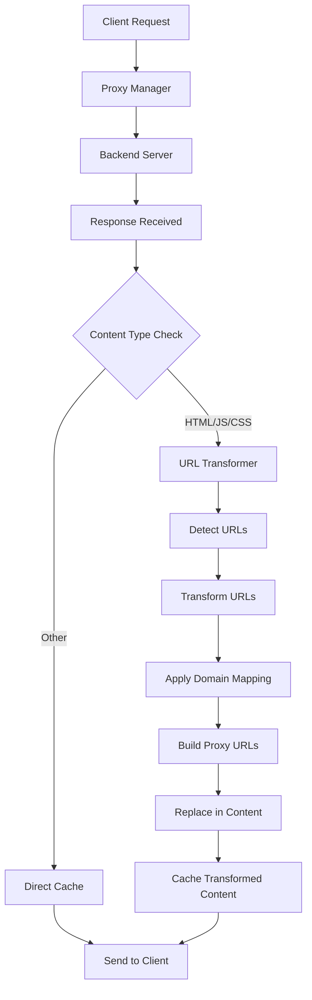

# URL Transformation Architecture Design

## Overview

This document outlines the comprehensive URL transformation system that will automatically detect and rewrite all URLs in HTML responses to route through the proxy server, completely obscuring the original server's domain, IP address, and path structure from end users.

## System Requirements

### Core Functionality
- **Comprehensive URL Detection**: Detect all URL types in HTML content (href, src, action, etc.)
- **URL Masking**: Transform URLs to route through proxy while hiding origin server details
- **Content Type Support**: Handle HTML, JavaScript, and CSS embedded URLs
- **URL Type Support**: Process absolute URLs, relative URLs, protocol-relative URLs
- **Edge Case Handling**: Proper handling of fragment identifiers, query parameters, URL encoding/decoding
- **Session Preservation**: Maintain session state and cookies during transformation

### Integration Requirements
- **Existing Architecture**: Integrate with current proxy-manager.js, domain-manager.js, and path-rewriter.js
- **Performance**: Minimal impact on response times with intelligent caching
- **Monitoring**: Full integration with existing metrics and logging systems
- **Configuration**: Flexible configuration options for different transformation scenarios

## Architecture Components

### 1. URL Transformer Module (`url-transformer.js`)

**Core Class: `URLTransformer`**

```javascript
class URLTransformer {
  constructor(config)
  transformContent(content, contentType, requestContext)
  transformURL(url, baseURL, requestContext)
  detectURLs(content, contentType)
  rewriteURL(originalURL, proxyHost, pathTransformation)
  validateTransformation(originalURL, transformedURL)
  getStats()
}
```

**Key Features:**
- **Multi-format Support**: HTML, JavaScript, CSS content transformation
- **Pattern-based Detection**: Regex patterns for different URL contexts
- **Intelligent Caching**: Cache transformation results for performance
- **Error Handling**: Graceful degradation when transformation fails
- **Statistics Tracking**: Comprehensive metrics for monitoring

### 2. URL Detection Patterns

**HTML Patterns:**
- Standard attributes: `href`, `src`, `action`, `formaction`, `data-*`
- Style attributes: `background`, `background-image`, `content`
- Meta tags: `content` attribute in meta refresh, canonical links

**JavaScript Patterns:**
- String literals containing URLs
- Dynamic URL construction
- AJAX endpoints and fetch calls
- Import statements and dynamic imports

**CSS Patterns:**
- `url()` functions in stylesheets
- `@import` statements
- Background images and fonts

### 3. URL Transformation Logic

**URL Classification:**
```javascript
const urlTypes = {
  ABSOLUTE: 'https://example.com/path',
  PROTOCOL_RELATIVE: '//example.com/path', 
  ROOT_RELATIVE: '/path/to/resource',
  RELATIVE: 'path/to/resource',
  FRAGMENT: '#section',
  QUERY_ONLY: '?param=value'
};
```

**Transformation Strategy:**
1. **Parse URL**: Extract components (protocol, host, path, query, fragment)
2. **Apply Domain Mapping**: Use existing path-rewriter logic for domain routing
3. **Construct Proxy URL**: Build new URL routing through proxy
4. **Preserve Context**: Maintain query parameters and fragments as configured
5. **Encode Result**: Proper URL encoding for safe transmission

### 4. Integration Points

**Proxy Manager Integration:**
- Hook into `handleProxyResponse()` method
- Transform content before caching
- Apply transformations based on content-type
- Maintain response headers and status codes

**Domain Manager Integration:**
- Leverage existing domain routing logic
- Use path transformation rules
- Respect domain-specific configurations
- Maintain backward compatibility

**Configuration Integration:**
- Extend existing config.js structure
- Environment variable support
- Runtime configuration updates
- Per-domain transformation settings

## Detailed Implementation Plan

### Phase 1: Core URL Transformer Module

**File: `url-transformer.js`**

```javascript
// Core transformation engine with:
// - URL detection patterns for HTML/JS/CSS
// - Transformation logic for all URL types
// - Caching system for performance
// - Error handling and fallbacks
// - Statistics and monitoring
```

**Key Methods:**
- `transformContent(content, contentType, context)` - Main transformation entry point
- `detectURLs(content, patterns)` - Find all URLs in content using regex patterns
- `transformURL(url, context)` - Transform individual URL using proxy routing
- `buildProxyURL(originalURL, proxyHost, pathMapping)` - Construct final proxy URL

### Phase 2: Proxy Manager Integration

**File: `proxy-manager.js` (modifications)**

**Integration Points:**
1. **Response Processing**: Add URL transformation to `handleProxyResponse()`
2. **Content-Type Detection**: Identify transformable content types
3. **Conditional Transformation**: Apply based on configuration and content size
4. **Cache Integration**: Store transformed content in cache
5. **Error Handling**: Graceful fallback when transformation fails

**Modified Flow:**
```
Original: Response → Cache → Send to Client
Enhanced: Response → URL Transform → Cache → Send to Client
```

### Phase 3: Configuration System

**File: `config.js` (extensions)**

**New Configuration Section:**
```javascript
urlTransformation: {
  enabled: process.env.URL_TRANSFORM_ENABLED === 'true',
  transformHTML: process.env.URL_TRANSFORM_HTML !== 'false',
  transformJavaScript: process.env.URL_TRANSFORM_JS !== 'false', 
  transformCSS: process.env.URL_TRANSFORM_CSS !== 'false',
  preserveFragments: process.env.URL_PRESERVE_FRAGMENTS !== 'false',
  preserveQueryParams: process.env.URL_PRESERVE_QUERY !== 'false',
  maxContentSize: parseInt(process.env.URL_TRANSFORM_MAX_SIZE || '10485760'), // 10MB
  cacheTransformations: process.env.URL_TRANSFORM_CACHE !== 'false',
  debugMode: process.env.URL_TRANSFORM_DEBUG === 'true'
}
```

### Phase 4: Architecture Documentation Updates

**File: `docs/for-ai/architecture.md` (updates)**

**New Sections:**
- URL Transformation System architecture
- Integration with existing components
- Performance considerations
- Configuration options
- Monitoring and debugging

## URL Transformation Flow Diagram



## URL Transformation Examples

### Example 1: HTML Link Transformation
```html
<!-- Original -->
<a href="https://backend.example.com/page">Link</a>

<!-- Transformed -->
<a href="https://proxy.domain.com/page">Link</a>
```

### Example 2: JavaScript URL Transformation
```javascript
// Original
fetch('https://api.backend.com/data')

// Transformed  
fetch('https://proxy.domain.com/api/data')
```

### Example 3: CSS URL Transformation
```css
/* Original */
background-image: url('https://cdn.backend.com/image.jpg');

/* Transformed */
background-image: url('https://proxy.domain.com/cdn/image.jpg');
```

## Performance Considerations

### Caching Strategy
- **Transformation Cache**: Cache URL transformation results
- **Pattern Cache**: Cache compiled regex patterns
- **Content Cache**: Cache fully transformed content
- **TTL Management**: Appropriate cache expiration times

### Optimization Techniques
- **Lazy Compilation**: Compile regex patterns on first use
- **Batch Processing**: Process multiple URLs in single pass
- **Size Limits**: Skip transformation for very large content
- **Selective Processing**: Only transform relevant content types

### Memory Management
- **Cache Size Limits**: Prevent memory bloat with LRU eviction
- **Streaming Processing**: Handle large content without full buffering
- **Garbage Collection**: Proper cleanup of transformation artifacts

## Security Considerations

### URL Validation
- **Malicious URL Detection**: Prevent injection attacks
- **Protocol Validation**: Only allow safe protocols (http/https)
- **Domain Validation**: Ensure transformed URLs are valid
- **Encoding Safety**: Proper URL encoding to prevent XSS

### Content Integrity
- **Transformation Verification**: Validate transformed content
- **Fallback Mechanisms**: Serve original content if transformation fails
- **Error Logging**: Log transformation failures for security analysis

## Testing Strategy

### Unit Tests
- URL detection pattern testing
- Individual URL transformation testing
- Edge case handling (malformed URLs, special characters)
- Performance benchmarking

### Integration Tests
- End-to-end proxy flow testing
- Content type handling verification
- Cache integration testing
- Error scenario testing

### Browser Compatibility Tests
- Cross-browser functionality verification
- JavaScript execution testing
- CSS rendering validation
- Mobile device testing

## Monitoring and Debugging

### Metrics Collection
- Transformation success/failure rates
- Performance timing metrics
- Cache hit/miss ratios
- Content size statistics

### Debug Features
- Detailed transformation logging
- URL mapping visualization
- Performance profiling
- Error tracking and reporting

### Health Checks
- Transformation system status
- Cache health monitoring
- Performance threshold alerts
- Error rate monitoring

## Migration and Rollout Plan

### Phase 1: Development and Testing
1. Implement core URL transformer module
2. Add basic proxy manager integration
3. Create comprehensive test suite
4. Performance testing and optimization

### Phase 2: Configuration and Documentation
1. Extend configuration system
2. Update architecture documentation
3. Create operational guides
4. Add monitoring and alerting

### Phase 3: Gradual Rollout
1. Deploy with transformation disabled by default
2. Enable for specific domains/content types
3. Monitor performance and error rates
4. Gradually expand coverage

### Phase 4: Full Production
1. Enable transformation by default
2. Optimize based on production metrics
3. Add advanced features (custom patterns, etc.)
4. Continuous monitoring and improvement

This architecture provides a comprehensive, scalable, and maintainable solution for URL transformation that integrates seamlessly with the existing proxy infrastructure while providing complete URL masking capabilities.
